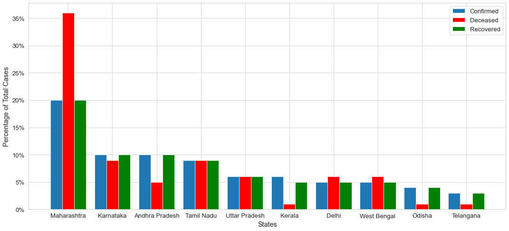
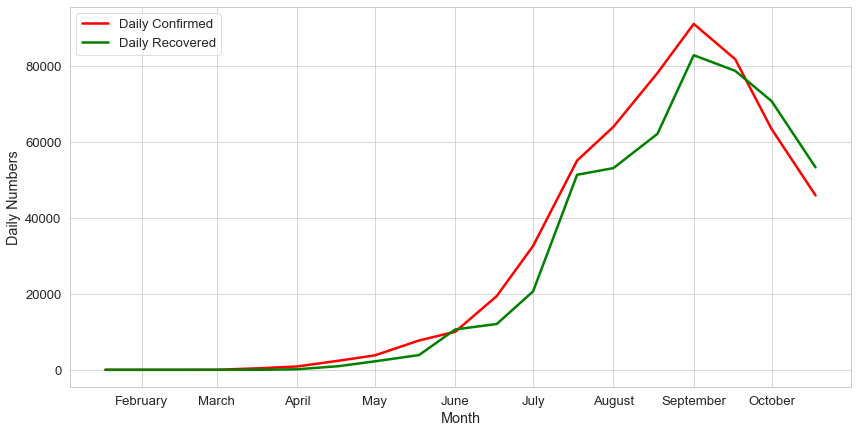
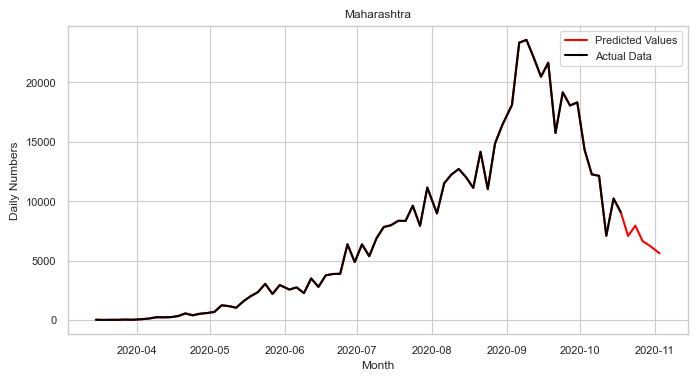
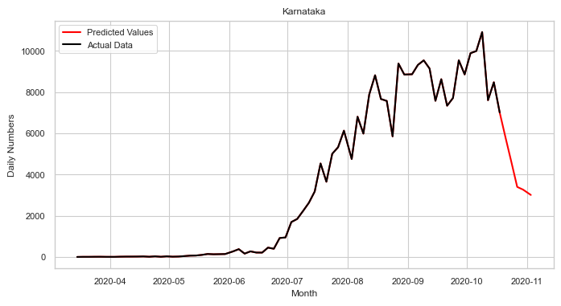
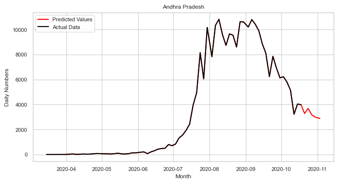
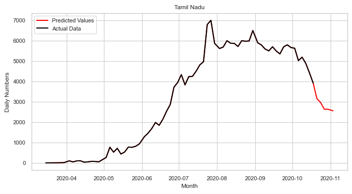
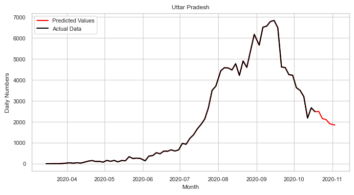
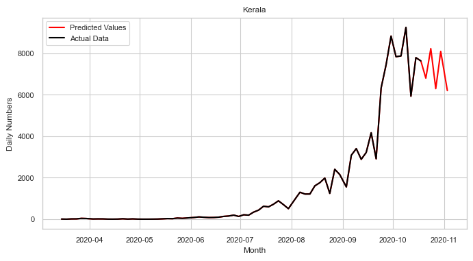
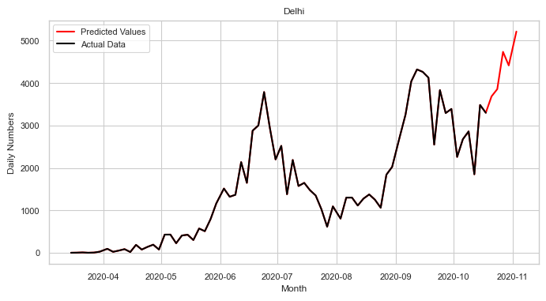
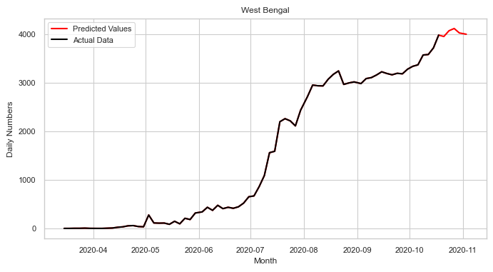

# Time Series Forecasting COVID-19

## Dataset

- case_time_series.csv : Time series of confirmed, recovered, deceased in India
- state_wise.csv : Current state wise situation
- state_wise_daily.csv : State wise time series of confirmed, recovered and deceased

## Data Analysis

  

  

## Results

  

  

  

  

  

  

  

  

  

  

